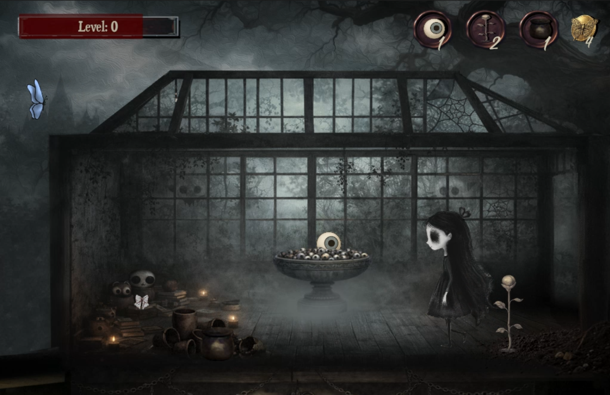

# Eye Shop — 2D Game Project (Unity)

**Playthrough:** https://drive.google.com/file/d/14S-Phaei2RFaAzGcduA9WQhqSAQoqXvl/view?usp=sharing

## Engine + Version
- **Unity 6.1** (6000.1.14f1)
- **Recommended display aspect ratio:** 4:3

## What the game is
A small **2D click-to-move** game where you explore a scene, **collect loot** (e.g., eyeballs, flowers, pots), and track progress through an **inventory + EXP/level UI**. Loot can **respawn** after being collected.

## My role
- **Solo developer** (graphics + code + setup)

## Controls
- **Left Click:** move the player to the clicked X position (player stays on the same Y “floor”)
- **Left Click on a door:** move the player to the other level
- **Left Click (when near loot):** pick up loot (pickup is blocked when clicking UI)

## Folder structure (high level)
- `Assets/Scenes/` — game scenes (Main Menu + game scene)
- `Assets/Prefabs/` — prefabs (loot, UI, etc.)
- `Assets/Animations/` — animation clips/controllers (player + loot)
- `Assets/Sprites/` — 2D art assets
- `Assets/Audio/` — SFX and music
- `Assets/Scripts/` — all gameplay scripts (see below)

## Systems implemented
- **Physics-based click-to-move movement** using Rigidbody2D velocity in `FixedUpdate()` (prevents jitter)
- **Loot pickup system** (trigger range + click to collect) with a global loot event (`Loot.OnItemLooted`)
- **Inventory system + UI slots** (stacking items, first empty-slot placement, UI refresh per slot)
- **Gold tracking** (gold is handled separately from inventory slots and updates UI text)
- **EXP + Level system** with slider + level text (supports multiple level-ups in one gain)
- **Loot respawn system** (pickup animation, hide, wait, then restore visuals/collider and enable pickup again)
- **Cursor click feedback** (custom cursor changes on click across scenes)
- **Background music player** (simple persistent music setup)

## Key scripts (with links)
### Player + Camera
- [`Assets/Scripts/Player/PlayerMovement.cs`](Assets/Scripts/Player/PlayerMovement.cs) — Click-to-move player controller using Rigidbody2D physics in `FixedUpdate()` + walking animation + footsteps audio
- [`Assets/Scripts/CameraMovement.cs`](Assets/Scripts/CameraMovement.cs) — Camera movement logic (scene framing / camera zones)

### Loot + Inventory
- [`Assets/Scripts/Inventory & Shop/Loot.cs`](Assets/Scripts/Inventory%20%26%20Shop/Loot.cs) — Loot interaction (trigger range + click to pick up), fires a global pickup event (`Loot.OnItemLooted`), and handles respawn
- [`Assets/Scripts/Inventory & Shop/InventoryManager.cs`](Assets/Scripts/Inventory%20%26%20Shop/InventoryManager.cs) — Inventory “brain” that listens to loot pickups, stacks items / fills the first empty slot, and updates gold + inventory UI
- [`Assets/Scripts/Inventory & Shop/InventorySlot.cs`](Assets/Scripts/Inventory%20%26%20Shop/InventorySlot.cs) — UI slot controller that displays icon/quantity and processes slot clicks (remove/drop/consume one item depending on current setup)
- [`Assets/Scripts/Inventory & Shop/ItemSO.cs`](Assets/Scripts/Inventory%20%26%20Shop/ItemSO.cs) — ScriptableObject definition for items (name, description, icon, gold flag)
- [`Assets/Scripts/Inventory & Shop/InventoryEntry.cs`](Assets/Scripts/Inventory%20%26%20Shop/InventoryEntry.cs) — Plain C# data class (constructor + encapsulated properties + `ToString()`)

### EXP / NPC / Menu
- [`Assets/Scripts/ExpManager.cs`](Assets/Scripts/ExpManager.cs) — EXP + Level progression that updates the EXP slider and level text
- [`Assets/Scripts/ButterflyNPC.cs`](Assets/Scripts/ButterflyNPC.cs) — Simple idle NPC movement (butterfly patrol between two points)
- [`Assets/Scripts/Main Menu/MainMenu.cs`](Assets/Scripts/Main%20Menu/MainMenu.cs) — Main menu logic (UI buttons / scene flow)
- [`Assets/Scripts/Main Menu/CursorClick.cs`](Assets/Scripts/Main%20Menu/CursorClick.cs) — Custom cursor behaviour (click cursor)
- [`Assets/Scripts/Main Menu/MusicPlayer.cs`](Assets/Scripts/Main%20Menu/MusicPlayer.cs) — Background music player setup (optional persistence)

## Bugs fixed
- **Player jitter / rapid flipping at destination** — moved velocity code to `FixedUpdate()` and used `Time.fixedDeltaTime` stop logic
- **Item duplicated into multiple slots** — returned after stacking and after placing into the first empty slot
- **EXP slider not updating unless leveling** — called `UpdateUI()` on every EXP change
- **Picking up world loot while clicking UI** — blocked pickup with `EventSystem.current.IsPointerOverGameObject()`
- **Respawn/audio issues after adding clips** — made audio calls null-safe and ensured an `AudioSource` + clips are assigned
